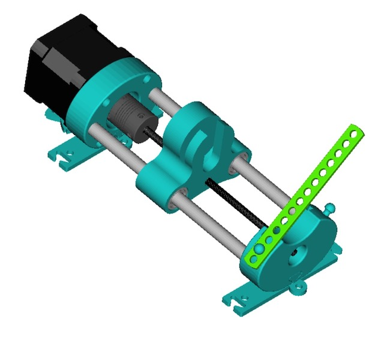
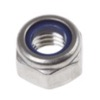

# Bill of Materials

## Mechanical Parts

Qty | Item | Notes
--- | :--- | :--- 
1	| NEMA 17 Stepper Motor             | IMPORTANT: check the terminal connector—it must be female, like in the photo. Otherwise it will need to be crimped.
2	| Smooth rod M8x150 mm           | IMPORTANT: be careful when cutting them so that they remain threaded or so that  bearings fit (smooth).
1	| Threaded rod M4x140 mm       |
2	| Linear bearing LM8UU    |	
1	| Radial bearing 624Z      |	
4	| Bolt M3x10 mm	                 |
1	| Lock nut M4   	                  |
1	| Coupling M5 to M4             | If not available, M5 to M5 can be adapted or it can be printed.

## Pipetting system

Qty | Item      | Notes
--- | :---      | :---
1	| Needle    | Without tip/bevel (variable diameter >1mm)
1	| Syringe   | With luer lock (20 mL, volume can change)
1	| Luer-lock | Male to female extension tube (>30cm – Depends  on printer)

## Printable parts (.stl files)

Qty | Item                  | Notes
--- | :---                  | :---
1	| motor support	        | 
1	| milano design support |
1	| push female piece	    |
1	| push male piece	    |
1	| syringe suport	    |
1	| pivot strip	        |
1	| syringe strip         | To be printed in Filaflex or other flexible materials
1	| milano support        |